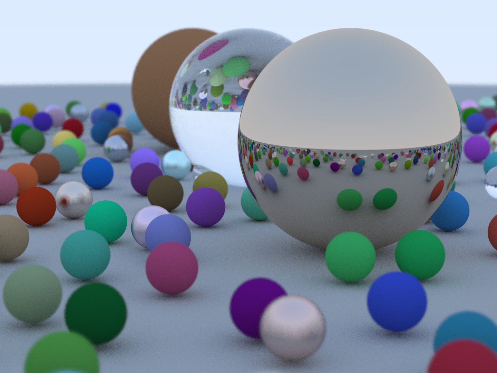

# gotrace



`gotrace` is a Golang implementation of Peter Shirley's [excellent books on raytracing](https://raytracing.github.io/).

I used it as a way to better understand Go interfaces. Being more familiar with object-oriented languages, I wondered how polymorphism behaviour could be implemented without inheritance. Turns out it is pretty awesome !

## Pros

- Strong concurrency primitives. Weighted semaphores are excellent to create a workgroup.
- Interfaces feels like a smarter way to provide polymorphism behaviour at runtime, compared to inheritance.

## Cons

- No operator overloading

```go
corner := lookFrom.Sub(u.Scale(width * focusDist)).Sub(v.Scale(height * focusDist)).Sub(w.Scale(focusDist))
```

would have been clearer as

```go
corner := lookfrom - u*width*focusDist - v*height*focusDist - w*focusDist
```

- No forward declarations

`Actor` needs to know about `Shape`, `Material` and `Ray`, but `Shape` also has to know about `Ray`, so they can't live in different packages without having to add unecessary complexity, because Go doesn't support forward declarations and can't resolve "circular" dependecies.
